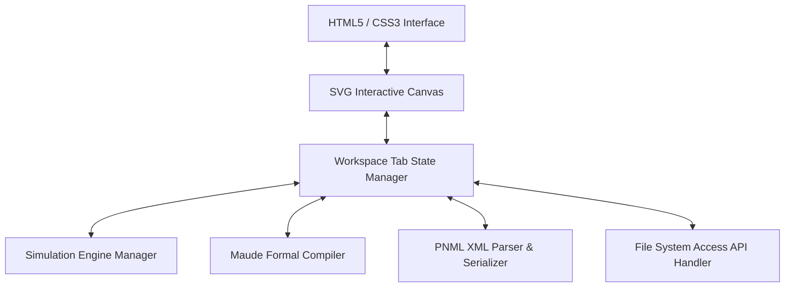
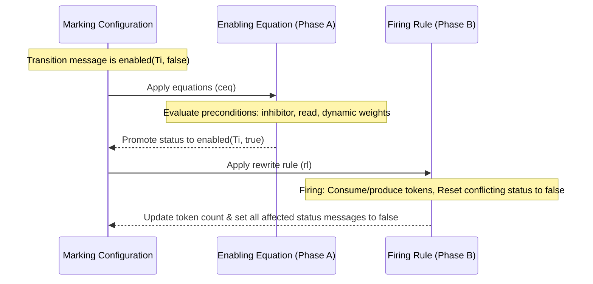

# Petri Net Editor & Simulator: Technical Specifications & Mechanics

This document provides a comprehensive technical overview of the Petri Net Editor & Simulator architecture, visual canvas mechanics, simulation engine semantics, formal Maude verification compiler, and XML serialization.

---

## 1. System Architecture Overview

The Petri Net Editor is built as a self-contained, zero-dependency client-side application. 



### Core Components
1. **Interactive Visual Canvas**: Powered by a dynamically updated SVG rendering node hierarchy. Supports scaling (Zoom), canvas translating (Pan), node dragging, and multi-segment path calculations for bend points.
2. **Workspace Tab State Manager**: Isolates the data model of multiple active sheets. Each tab retains its own node list, arc list, simulation status, pan offsets, and local file handle.
3. **Simulation Engine**: An event-driven state machine that evaluates Petri Net liveness, enforces capacities, resolves priority conflicts, and updates token layouts client-side.
4. **Maude Formal Compiler**: Translates the graphical topology into a rewriting logic specification under the **Two-Phase Enabling/Firing Protocol**.
5. **PNML Parser & Serializer**: Standardized XML parser mapping coordinates, visual routes, notes, and custom arc attributes to PNML schema configurations.

---

## 2. Visual Editor Mechanics

### Pan and Zoom Coordinate Calculations
The canvas coordinates are managed using screen space and canvas space translation functions:
$$\mathbf{X}_{canvas} = \frac{\mathbf{X}_{screen} - dx}{scale}$$
$$\mathbf{Y}_{canvas} = \frac{\mathbf{Y}_{screen} - dy}{scale}$$
- $dx, dy$ are pan offset attributes updated via canvas mouse drags in `Select` mode.
- $scale$ is the zoom multiplier incremented or decremented via the zoom buttons or keyboard shortcuts.

### Multi-Segment Arc Routing (Bend Points)
Arcs are drawn using SVG `<path>` elements. Double-clicking an arc inserts a new bend point.
- Paths are rendered using cubic command chaining:
  - If no bend points exist: `M x1 y1 L x2 y2`
  - If bend points exist: `M x1 y1 L p1_x p1_y ... L pn_x pn_y L x2 y2`
- Arrowheads are drawn using marker orientation adjustments (`marker-end="url(#arrow)"`), matching the mathematical angle of the last path segment:
  $$\theta = \text{atan2}(y_2 - y_n, x_2 - x_n)$$

---

## 3. Petri Net Semantics & Simulation Engine

### Capacity Constraint (K-Limit)
A place $P$ is restricted by a maximum capacity $K(P) \in \mathbb{N} \cup \{\infty\}$. For a transition $T$ to be enabled, firing it must not violate the capacity constraint of any output place:
$$M(P) - Consumed(T, P) + Produced(T, P) \le K(P)$$

### Priority-Based Conflict Resolution
If multiple transitions are enabled simultaneously and share resources, conflicts are resolved in two stages:
1. **Priority Hierarchy**: The engine filters enabled transitions to find the maximum priority value:
   $$\text{Enabled}_{max\_prio} = \{ T_k \in \text{Enabled} \mid \text{Priority}(T_k) = \max_{t \in \text{Enabled}} \text{Priority}(t) \}$$
2. **Nondeterministic Choice**: If multiple transitions share the highest priority, a random candidate is selected and fired:
   $$T_{fired} = \text{random\_choice}(\text{Enabled}_{max\_prio})$$

---

## 4. Arc Types & Semantic Rules

| Arc Type | Visual Token | Enabling Precondition | Token Consumption Rule |
| :--- | :---: | :--- | :--- |
| **Normal Input Arc** | Solid Arrow | $M(P) \ge W$ | $M'(P) = M(P) - W$ |
| **Normal Output Arc** | Solid Arrow | Always Enabled | $M'(P) = M(P) + W$ |
| **Inhibitor Arc** | Hollow Circle ($\circ$) | $M(P) < W$ | $M'(P) = M(P)$ (No flow) |
| **Read (Test) Arc** | Solid Arrow | $M(P) \ge W$ | $M'(P) = M(P)$ (No flow) |
| **Reset Arc** | Double Chevron ($\gg$) | Always Enabled | $M'(P) = 0$ (Total drain) |
| **Dynamic Arc Weight** | Formula Badge | $M(P) > W$ (Strictly greater) | $M'(P) = W$ (Sets token count to threshold) |

*Note: For the Dynamic Arc Weight (Dynamic Drain), the expression is formulated as $M(P) - W$, meaning it drains the surplus above the threshold $W$. It is enabled strictly when a surplus exists ($M(P) > W$) to prevent infinite zero-effect firing loops.*

---

## 5. Formal Verification Compiler: The Maude Exporter

The generator compiles visual Petri Net topologies into [Maude rewriting logic](https://maude.cs.illinois.edu/) modules using a conditional OO semantics template.

### The Two-Phase Rewriting Logic Protocol
Because rewriting rules in Maude are naturally nondeterministic and hard to coordinate for transient conditions (like inhibitor arcs and capacity checks), the compiler splits execution into a **Two-Phase Protocol**:



1. **Phase A (The Equational Evaluation)**: Conditionally evaluates whether transitions are enabled. These equations (`ceq`) run with priority over rewrite rules, promoting the status message from `enabled(T, false)` to `enabled(T, true)`.
2. **Phase B (The Rewrite Rule Execution)**: Rewrite rules (`rl`) represent the actual physical token movements. Firing a transition updates the places and resets the enabling status of the transition and its conflicting neighborhood back to `false`.

### Phase A: Enabling Equations (`ceq`)
For each non-source transition $T_i$, an equation checks all input preconditions:
$$\text{ceq}\quad \langle P_1 \mid \text{N} : v_1 \rangle \dots \text{enabled}(T_i, \text{false}) = \langle P_1 \mid \text{N} : v_1 \rangle \dots \text{enabled}(T_i, \text{true})\quad \text{if}\quad \text{Cond}_1 \text{ and } \dots \text{ and } \text{Cond}_n .$$

The conditions are compiled based on arc types:
- **Normal Input / Read Arcs**: `(v_j >= W)`
- **Inhibitor Arcs**: `(v_j < W)` (Strictly less than)
- **Dynamic Arc Weights**: `(v_j > W)` (Strictly greater than)

### Phase B: Firing Rewrite Rules (`rl`)
Firing rewrite rules consume and produce tokens and globally reset the status of all affected transitions to false:
$$\text{rl}\quad \langle P_{\text{involved}} \mid \text{N} : v_k \rangle \dots \text{enabled}(T_i, \text{true})\ \mathbf{enabled(T_j, state\text{-}t_j)} \dots \Rightarrow \langle P_{\text{involved}} \mid \text{N} : v'_k \rangle \dots \text{enabled}(T_i, \text{false})\ \mathbf{enabled(T_j, \text{false})} \dots$$

#### The Conflict Neighborhood Reset
To prevent stale enabling states, if transition $T_i$ firing modifies a place $P$ in a way that invalidates the preconditions of $T_j$, the rule for $T_i$ matches `enabled(T_j, state-tj)` on the Left-Hand Side (LHS) and rewrites it to `enabled(T_j, false)` on the Right-Hand Side (RHS).
- **Wildcard Variables**: To avoid constraint matching failures when multiple transitions conflict, each conflicting transition $T_j$ uses its own independent Boolean wildcard variable named `state-tj` (e.g. `state-t1`, `state-t2`).
- **Conflict Table**:
  - If $T_j$ has a **Normal or Read arc** from $P$: Reset if $T_i$ decreases or alters $P$.
  - If $T_j$ has an **Inhibitor arc** from $P$: Reset if $T_i$ increases, alters, or resets $P$.
  - If $T_j$ has a **Dynamic Arc Weight** from $P$: Reset if $T_i$ alters $P$ in any way.

---

## 6. Persistence: PNML Serialization

Models are serialized into XML adhering to the Petri Net Markup Language (PNML) standards, augmented with custom layout tags.

### Mapping Schema

```xml
<pnml>
  <net id="n1" type="http://www.pnml.org/version-2009/grammar/ptnet">
    <!-- Places -->
    <place id="P1">
      <graphics>
        <position x="150" y="200"/>
      </graphics>
      <initialMarking>
        <text>3</text>
      </initialMarking>
      <capacity>
        <text>10</text>
      </capacity>
    </place>

    <!-- Transitions -->
    <transition id="T1">
      <graphics>
        <position x="300" y="200"/>
      </graphics>
      <priority>
        <text>2</text>
      </priority>
    </transition>

    <!-- Arcs -->
    <arc id="A1" source="P1" target="T1">
      <type>
        <text>dynamic</text> <!-- normal, inhibitor, read, reset, dynamic -->
      </type>
      <inscription>
        <text>3</text> <!-- Weight threshold -->
      </inscription>
      <!-- Visual route routing points -->
      <graphics>
        <position x="220" y="180"/>
      </graphics>
    </arc>

    <!-- Text Annotations / Notes -->
    <labels id="note1">
      <text>This transition drains the surplus of P1 above 3 tokens</text>
      <graphics>
        <position x="100" y="50"/>
        <dimension x="150" y="80"/>
      </graphics>
    </labels>
  </net>
</pnml>
```

---

## 7. Performance & Verification Capabilities

- **State Space Exploration**: In Maude, using the command `search initial =>* C:Configuration .` computes the complete reachability tree.
- **Deadlock Detection**: Finds states with no enabled transitions:
  `search initial =>! C:Configuration .`
- **Linear Temporal Logic (LTL) Model Checking**: Check if invariant system safety conditions hold under all execution paths.
