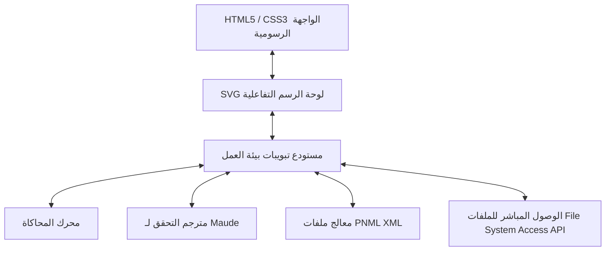
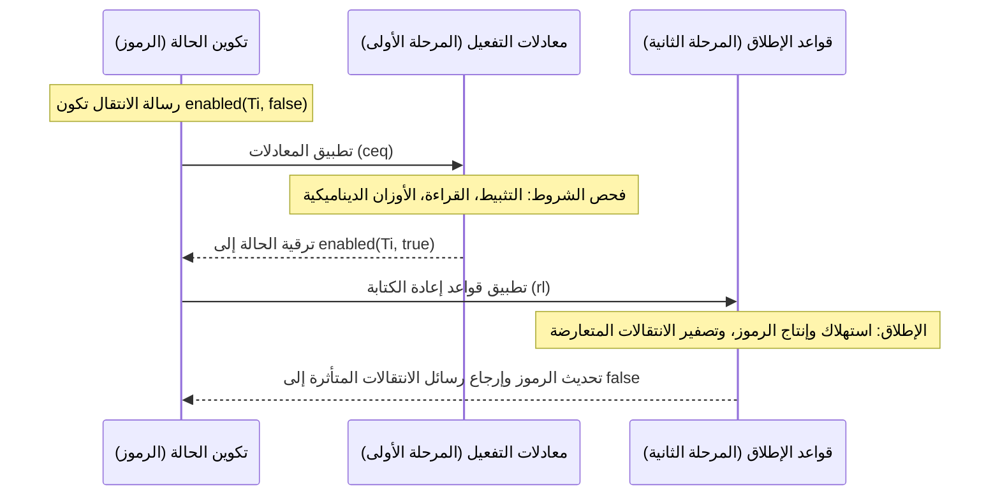

# محرر ومحاكي شبكات بتري: الخصائص الفنية وآليات العمل (Technical Specs)

يوفر هذا المستند نظرة عامة شاملة وتفصيلية عن البنية الفنية لمحرر ومحاكي شبكات بتري (Petri Net Editor & Simulator)، بما في ذلك آليات اللوحة المرئية، وقواعد محرك المحاكاة، ومترجم التحقق الصوري لـ Maude، وطرق الحفظ بلغة PNML XML.

---

## 1. البنية المعمارية العامة للنظام (System Architecture)

تم تصميم محرر شبكات بتري كتطبيق ويب مستقل بالكامل يعمل في جهة العميل (Client-side) دون أي اعتماديات خارجية (Zero-dependency).



### المكونات البرمجية الأساسية:
1. **لوحة الرسم التفاعلية (Visual Canvas)**: تعتمد على شجرة عناصر SVG يتم تحديثها ديناميكياً لتوفير تجربة تفاعلية تدعم التقريب (Zoom)، وتحريك اللوحة (Pan)، وسحب العقد، وحساب مسارات الأقواس المنحنية.
2. **مستودع تبويبات بيئة العمل (Workspace Tab State)**: يعزل بيانات كل شبكة بتري بشكل كامل عن الأخرى، حيث تحتفظ كل علامة تبويب بقائمة العقد الخاصة بها، والأقواس، وحالة المحاكاة، ونسبة التقريب، ومقبض الملف المحلي المرتبط بها.
3. **محرك المحاكاة (Simulation Engine)**: يعمل كآلة حالة تعتمد على الأحداث (Event-driven state machine) تقوم بتقييم حيوية الشبكة، وتفرض قيود القدرة الاستيعابية للأماكن، وتحل التعارضات بناءً على الأولويات.
4. **مترجم Maude الصوري (Maude Formal Compiler)**: يقوم بتحويل طوبولوجيا الشبكة المرئية إلى منطق إعادة كتابة صوري خاضع لـ **بروتوكول الخطوتين (Two-Phase Protocol)**.
5. **معالج PNML XML**: يقرأ ويكتب ملفات XML القياسية لشبكات بتري مع حفظ الإحداثيات الرسومية، ومسارات الأقواس، والملاحظات النصية، والخصائص المخصصة للأقواس.

---

## 2. آليات اللوحة الرسومية (Visual Canvas Mechanics)

### حسابات إحداثيات التحريك والتقريب (Pan & Zoom)
تتم ترجمة الإحداثيات بين مساحة الشاشة الرسومية ومساحة لوحة الرسم الفعلية وفق المعادلات التالية:
$$\mathbf{X}_{canvas} = \frac{\mathbf{X}_{screen} - dx}{scale}$$
$$\mathbf{Y}_{canvas} = \frac{\mathbf{Y}_{screen} - dy}{scale}$$
- $dx, dy$: يمثلان إزاحة تحريك اللوحة (Pan offset) ويتم تحديثهما عند سحب اللوحة بالفأرة في وضع التحديد `Select`.
- $scale$: معامل التقريب/الإبعاد (Zoom factor) ويتم تعديله عبر أزرار التقريب أو اختصارات الكيبورد.

### توجيه الأقواس ذات النقاط المتعددة (Bend Points)
تُرسم الأقواس باستخدام عناصر SVG من نوع `<path>`. عند النقر المزدوج على القوس، يتم إدراج نقطة انحناء جديدة.
- يتم توليد مسار الرسم ديناميكياً باستخدام إحداثيات النقاط:
  - بدون نقاط انحناء: `M x1 y1 L x2 y2`
  - بوجود نقاط انحناء: `M x1 y1 L p1_x p1_y ... L pn_x pn_y L x2 y2`
- يتم توجيه رأس السهم تلقائياً عند نهاية المسار باستخدام السمة `marker-end` بناءً على زاوية الميل لآخر مقطع في المسار:
  $$\theta = \text{atan2}(y_2 - y_n, x_2 - x_n)$$

---

## 3. قواعد محرك المحاكاة لشبكة بتري

### قيد القدرة الاستيعابية للمكان (Capacity Constraint / K-Limit)
يُحدَّد كل مكان $P$ بقدرة استيعابية قصوى $K(P) \in \mathbb{N} \cup \{\infty\}$. لكي يكون الانتقال $T$ مفعلاً ومؤهلاً للإطلاق، يجب ألا يؤدي إطلاقه إلى تجاوز القدرة الاستيعابية لأي مكان مخرج:
$$M(P) - Consumed(T, P) + Produced(T, P) \le K(P)$$

### حل التعارضات بالأولويات (Priority Conflict Resolution)
عند تفعيل انتقالات متعددة في نفس الوقت وتنافسها على نفس الرموز، يتم حل التعارض على مرحلتين:
1. **تصفية الأولويات**: يختار المحرك الانتقالات التي تمتلك أعلى قيمة أولوية (`Priority` أو `Fire Order`):
   $$\text{Enabled}_{max\_prio} = \{ T_k \in \text{Enabled} \mid \text{Priority}(T_k) = \max_{t \in \text{Enabled}} \text{Priority}(t) \}$$
2. **الاختيار العشوائي**: إذا تساوت الأولويات بين الانتقالات المفعّلة المتعارضة، يتم اختيار أحدها عشوائيًا لإطلاقه:
   $$T_{fired} = \text{random\_choice}(\text{Enabled}_{max\_prio})$$

---

## 4. أنواع الأقواس وقواعدها الدلالية (Arc Types)

| نوع القوس | الشكل البصري | شرط تفعيل الانتقال | قاعدة استهلاك الرموز عند الإطلاق |
| :--- | :---: | :--- | :--- |
| **قوس مدخل عادي (Normal Input)** | سهم مصمت | $M(P) \ge W$ | $M'(P) = M(P) - W$ |
| **قوس مخرج عادي (Normal Output)** | سهم مصمت | مفعّل دائماً | $M'(P) = M(P) + W$ |
| **قوس تثبيط (Inhibitor Arc)** | سهم بنهاية دائرية مفرغة ($\circ$) | $M(P) < W$ | $M'(P) = M(P)$ (لا يستهلك رموزاً) |
| **قوس قراءة/فحص (Read/Test Arc)** | سهم مصمت | $M(P) \ge W$ | $M'(P) = M(P)$ (لا يستهلك رموزاً) |
| **قوس إعادة تعيين (Reset Arc)** | سهم برأسين مزدوجين ($\gg$) | مفعّل دائماً | $M'(P) = 0$ (تفريغ وتصفير المكان بالكامل) |
| **وزن قوس ديناميكي (Dynamic Arc Weight)** | شارة صيغة رياضية | $M(P) > W$ (أكبر قطعيّاً) | $M'(P) = W$ (يعيد تعيين رموز المكان لعتبة الوزن) |

*ملاحظة: بالنسبة للقوس ذي الوزن الديناميكي، يُعبر عن الاستهلاك بـ $M(P) - W$، حيث يسحب فقط الفائض فوق العتبة $W$. ويشترط تفعيله وجود فائض حقيقي ($M(P) > W$) لتجنب الوقوع في حلقات تشغيل لا نهائية عديمة الفائدة.*

---

## 5. مترجم التحقق الصوري: التصدير لـ Maude

يقوم المصدّر بتحويل شبكة بتري الرسومية إلى نموذج رياضي بلغة [Maude rewriting logic](https://maude.cs.illinois.edu/) باستخدام صياغة شرطية كائنية التوجه.

### بروتوكول الخطوتين (The Two-Phase Protocol)
نظرًا لأن قواعد إعادة الكتابة في Maude هي بطبيعتها عشوائية وغير حتمية (Nondeterministic)، ويصعب إخضاعها لشروط لحظية معقدة (مثل شروط التثبيط وقدرة الأماكن الاستيعابية)، قمنا بتقسيم التشغيل إلى **بروتوكول من مرحلتين**:



1. **المرحلة الأولى (تقييم المعادلات الجبرية - Phase A)**: يتم فحص شروط التفعيل بشكل لحظي عبر معادلات شرطية (`ceq`). هذه المعادلات تمتلك أولوية قصوى في Maude وتنفذ قبل قواعد النقل، لترقية حالة الانتقال من `enabled(T, false)` إلى `enabled(T, true)`.
2. **المرحلة الثانية (قواعد إعادة الكتابة - Phase B)**: تمثل قواعد إعادة الكتابة (`rl`) عملية النقل الفيزيائي للرموز. يؤدي إطلاق انتقال $T_i$ إلى استهلاك وإنتاج الرموز وتصفير (Reset) رسائل تفعيل الانتقال نفسه وجميع الانتقالات المتعارضة معه إلى `false`.

### المرحلة الأولى: معادلات التفعيل شرطية الحدوث (`ceq`)
لكل انتقال غير مصدري $T_i$، يتم إنشاء معادلة للتحقق من شروط الإدخال:
$$\text{ceq}\quad \langle P_1 \mid \text{N} : v_1 \rangle \dots \text{enabled}(T_i, \text{false}) = \langle P_1 \mid \text{N} : v_1 \rangle \dots \text{enabled}(T_i, \text{true})\quad \text{if}\quad \text{Cond}_1 \text{ and } \dots \text{ and } \text{Cond}_n .$$

تتولد الشروط حسب نوع القوس:
- **القوس العادي وقوس القراءة (Read/Normal)**: `(v_j >= W)`
- **قوس التثبيط (Inhibitor)**: `(v_j < W)` (أقل قطعيّاً)
- **قوس الوزن الديناميكي (Dynamic Arc Weight)**: `(v_j > W)` (أكبر قطعيّاً)

### المرحلة الثانية: قواعد إطلاق الانتقال وكتابة الرموز (`rl`)
تقوم قاعدة الإطلاق بتحديث الرموز في الأماكن، وتصفير حالة الانتقالات المتأثرة بشكل كامل:
$$\text{rl}\quad \langle P_{\text{involved}} \mid \text{N} : v_k \rangle \dots \text{enabled}(T_i, \text{true})\ \mathbf{enabled(T_j, state\text{-}t_j)} \dots \Rightarrow \langle P_{\text{involved}} \mid \text{N} : v'_k \rangle \dots \text{enabled}(T_i, \text{false})\ \mathbf{enabled(T_j, \text{false})} \dots$$

#### آلية تصفير التعارض الهيكلي (Conflict Reset)
لمنع بقاء الانتقالات في حالة تفعيل خاطئة بعد استهلاك الرموز التي تعتمد عليها، إذا أدى إطلاق $T_i$ إلى تغيير الرموز في مكان $P$ بما قد يبطل شروط الانتقال الآخر $T_j$، فإن قاعدة $T_i$ ستتضمن المتغير الحر `enabled(T_j, state-tj)` في الطرف الأيسر (LHS) لتقوم بإعادة ضبطه إلى `enabled(T_j, false)` في الطرف الأيمن (RHS).
- **المتغيرات الحرة المستقلة (Wildcard Variables)**: لمنع حدوث مشاكل في مطابقة الشروط عند وجود تعارضات متعددة، يُخصص لكل انتقال متعارض $T_j$ متغير بولياني مستقل يُسمى بالنمط `state-tj` (مثل `state-t1` و `state-t2`).
- **جدول معالجة التعارضات**:
  - إذا كان لـ $T_j$ **قوس عادي أو قوس قراءة** من المكان $P$: يتم تصفيره إذا أدى إطلاق $T_i$ لتقليل أو تغيير رموز $P$.
  - إذا كان لـ $T_j$ **قوس تثبيط** من المكان $P$: يتم تصفيره إذا أدى إطلاق $T_i$ لزيادة، أو تغيير، أو تصفير رموز $P$.
  - إذا كان لـ $T_j$ **قوس بوزن ديناميكي** من المكان $P$: يتم تصفيره فوراً عند حدوث أي تغيير لرموز $P$ بفعل $T_i$.

---

## 6. حفظ النماذج بصيغة PNML XML

تُحفظ هياكل الرسوم في ملفات XML متوافقة مع المعيار الدولي للغة ترميز شبكات بتري (PNML)، مع دمج وسوم مخصصة للتنسيقات المرئية والملاحظات.

### هيكل ملف الحفظ (PNML Schema Example)

```xml
<pnml>
  <net id="n1" type="http://www.pnml.org/version-2009/grammar/ptnet">
    <!-- الأماكن (Places) -->
    <place id="P1">
      <graphics>
        <position x="150" y="200"/>
      </graphics>
      <initialMarking>
        <text>3</text>
      </initialMarking>
      <capacity>
        <text>10</text>
      </capacity>
    </place>

    <!-- الانتقالات (Transitions) -->
    <transition id="T1">
      <graphics>
        <position x="300" y="200"/>
      </graphics>
      <priority>
        <text>2</text>
      </priority>
    </transition>

    <!-- الأقواس (Arcs) -->
    <arc id="A1" source="P1" target="T1">
      <type>
        <text>dynamic</text> <!-- normal, inhibitor, read, reset, dynamic -->
      </type>
      <inscription>
        <text>3</text> <!-- عتبة الوزن الاستهلاكي -->
      </inscription>
      <!-- نقاط انحناء مسار القوس الرسومية -->
      <graphics>
        <position x="220" y="180"/>
      </graphics>
    </arc>

    <!-- الملاحظات والنصوص التوثيقية على اللوحة -->
    <labels id="note1">
      <text>يقوم هذا الانتقال بتصريف الفائض من P1 فوق 3 رموز</text>
      <graphics>
        <position x="100" y="50"/>
        <dimension x="150" y="80"/>
      </graphics>
    </labels>
  </net>
</pnml>
```

---

## 7. قدرات التحقق والبحث الصوري في Maude

بمجرد تصدير الكود إلى ملف `.maude` وتشغيل بيئة Maude، يتيح النموذج إجراء التحققات الصارمة التالية:
- **استكشاف كامل فضاء الحالات (State Space Exploration)**:
  `search initial =>* C:Configuration .`
- **الكشف عن حالات التوقف التام (Deadlocks)**:
  `search initial =>! C:Configuration .`
- **التحقق من الخصائص باستخدام LTL (Model Checking)**: للتحقق من سلامة وثبات خصائص النظام في كافة مسارات التنفيذ الممكنة.
